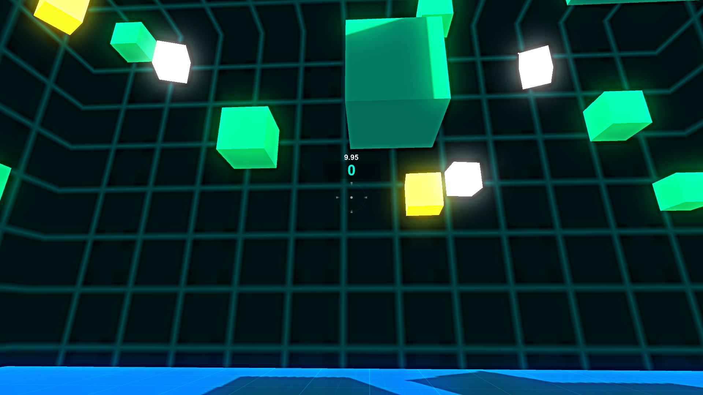
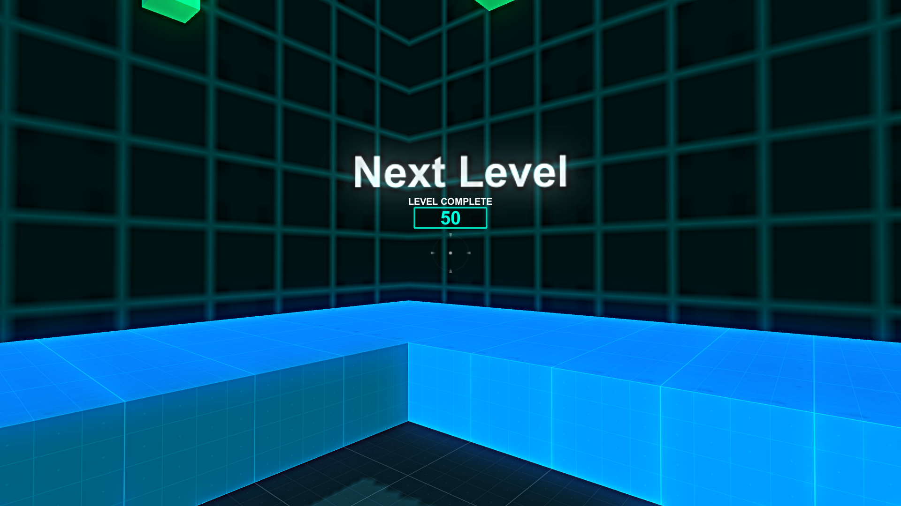
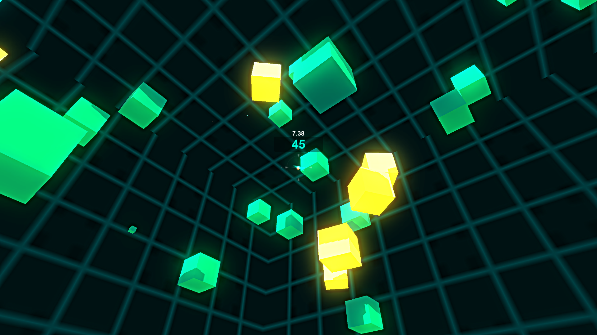

# Box-Shooter
 
> This project is the 3rd assignment of "[Introduction to Game Development](coursera.org/learn/game-development/)" course by [Coursera](https://www.coursera.org/).

- In this game you have to shoot the box(target) in given time. there are 3 different types to boxes. each have different behavior.

    1. Blue Box( increase score by 5)
    2. Yellow Box( decrease time by 3sec )
    3. White Box( increase time by 3sec )

### Screenshots

